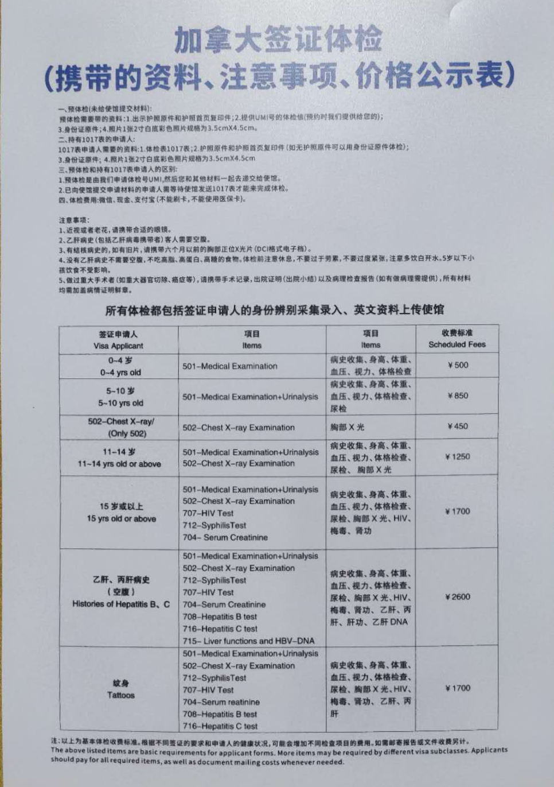

很多申请人在加拿大签证或者移民进行到体检阶段时，最担心的是自己的既往病史：“我几年前得过癌症、做过大手术，会不会被拒？”“我有糖尿病、高血压，体检会不会有问题？”

加拿大移民体检并不是在挑选“完全没有疾病”的申请人。关键是看你的具体情况是否触及加拿大移民法规定的健康原因不准入。

## 加拿大移民局要求的体检一般检查什么？

加拿大移民体检必须由加拿大移民局指定的体检医生完成。你自己的家庭医生、专科医生可以提供报告，但不能代替指定医生完成体检。

*注：上图为一位客户友情提供的中国国内某机构的体检项目列表。照片中的收费属于特定机构和特定时期，非统一或现行收费标准。*

## 体检不只是看“有没有病”

对于有重大病史的人，体检和后续医学评估最关心的不是你“得没得过这个病”，而是这一串问题：

- 当时诊断到底是什么？
- 病情到什么阶段了？
- 做过哪些治疗？
- 治疗完没完？
- 现在还要不要吃药、复查？
- 目前身体状态如何？
- 将来可能需要什么医疗或社会服务？
- 复发风险有多大？

说白了，移民局评估的不只是你的过去，还有你的现在，以及将来五年、十年里你可能用到哪些公费医疗资源。同一种病，在不同申请人身上，结果可能差很远。

举个例子：同样是癌症病史，一个人已经完成治疗，很多年没有复发，只需要定期复查；另一个人还在化疗、放疗，或者使用昂贵的靶向药。这两个人未来预计使用的医疗资源，完全不是一个级别。

## 有癌症病史怎么办？

如果你过去五年内确诊过癌症、出现过复发，或者接受过癌症治疗，加拿大移民局的体检指引通常要求你提供近期的肿瘤科报告。如果是五年前的癌症，并且这五年里没治疗、没复发，加拿大移民局可能不会要求体检医生专门给你安排新的专科评估。但如果你手头有主治医生写的近期报告，也可以交给体检医生，会更有帮助。

注意，“五年”不是一条自动过关线。它只是加拿大移民局对体检医生“要不要取得近期肿瘤科报告”的技术指引。真正作出决定，还是要看你的具体病情。

## 什么情况下可能因健康原因不准入？

加拿大移民及难民保护法第38条规定了三类健康原因不准入：

1. 健康状况可能危害**公共健康**；
2. 健康状况可能危害**公共安全**；
3. 健康状况可能对加拿大的医疗或社会服务造成**过度需求**。

这三项标准针对的是不同问题，不能混在一起理解。

### 一、危害公共健康

公共健康这条，主要是看你的病有没有传染风险，会不会影响其他加拿大人。例如：

- 活动性肺结核；
- 活动性梅毒；
- 跟某些传染病患者有密切接触的情况。

但“曾经感染过”不等于永久不能过关。比如活动性肺结核，如果你先把病治好，复查确认没有传染性，评估结果就可以改变。有些人是潜伏性结核感染，即使获准入境，也可能只需要接受入境后的医学监测。

HIV 阳性本身，加拿大移民局通常也不认为是对公共健康的威胁。对于适用过度需求规则的人，真正要计算的是治疗费用和未来医疗需求，而不是单纯因为 HIV 诊断就拒绝。

### 二、危害公共安全

这条看的是你的健康状况会不会导致：突然失去身体或精神行为能力；作出不可预测的危险行为；出现暴力行为；对加拿大境内其他人的健康或安全造成现实风险。

注意，精神疾病诊断本身不是拒绝理由。比如抑郁症、双相情感障碍、精神分裂症，都不自动构成公共安全方面的不准入。评估时要看很多因素，比如：病情控制得怎么样；有没有定期治疗；有没有按时吃药；以前有没有暴力史；现在有没有现实的复发或失控风险；有没有可行的治疗和风险管理方案。

### 三、对医疗或社会服务造成过度需求

从我们接到的咨询来看，申请人最常遇到的其实是这一条，也就是对加拿大医疗或社会服务造成过度需求。

#### 2026年的费用门槛是多少？每年28,878加元，或者五年合计144,390加元。

加拿大移民局通常会估算你体检后连续五年内预计所需的公费医疗和社会服务。如果有证据显示大额费用可能出现在五年之后，评估期可以延长，但最长不超过十年。

如果你未来预计需要的公费医疗和社会服务成本超过规定门槛，就可能构成过度需求。

计算可能包括：医生、专科医生费用；医院门诊和住院；化验和影像检查；政府报销的药费；护理、物理治疗和其他公费服务；居家护理；长期机构照护；跟健康状况相关的个人支持服务。

#### 为什么有存款，也不能简单承诺自费解决？

你有多少资产，跟你未来预计会使用多少公费医疗，是两个问题。在某些案件里，你可以提交减轻负担计划，资金能力可能是证明计划可信的一部分。但是，一般不能只表态“我放弃公费医疗”或者“我自己支付医药费”，就当然解决移民局对过度需求的疑虑。

#### 除了费用，还要考虑轮候名单

就算你的费用低于金额门槛，如果你需要的治疗或服务会严重加长加拿大的医疗轮候队伍，影响加拿大公民或永久居民及时获得服务，也可能构成过度需求。

所以金额不是唯一标准。有些器官移植、长期护理床位本来就严重短缺，可能同时涉及费用和轮候两个问题。

#### 过度需求规则是否适用于所有申请人？

不是。根据加拿大移民及难民保护法第38(2)条，过度需求规则不适用于难民及部分相关家属、受保护人士，以及家庭团聚类别中的部分受担保配偶、同居伴侣和子女。

但这些申请人仍然需要接受公共健康和公共安全评估。

还要注意，不是所有家庭团聚申请人都获得过度需求豁免。例如，父母和祖父母团聚申请通常仍然需要接受过度需求评估。

## [下一篇：哪些疾病风险较高？体检不通过怎么办？](../medical-inadmissibility-disease-risk-next-steps-part-2/)

*本文仅提供一般法律信息，不构成针对任何个人案件的法律意见。移民体检要求、费用门槛和程序可能调整，应以申请时的现行法律、加拿大移民局官方指引和具体通知为准。*

**官方参考资料：**

- [加拿大移民局：健康原因不准入及2026年金额门槛](https://www.canada.ca/en/immigration-refugees-citizenship/services/admissibility-enforcement/inadmissibility/medical.html)
- [加拿大移民及难民保护法第38条](https://laws-lois.justice.gc.ca/eng/acts/i-2.5/section-38.html)
- [加拿大移民局：指定体检医生指南及癌症技术指引](https://www.canada.ca/en/immigration-refugees-citizenship/corporate/publications-manuals/panel-members-guide.html)
