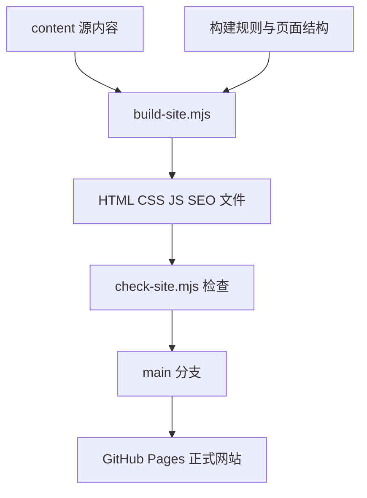

# CanWise Website 工作手册

版本：1.3  
核对日期：2026年8月31日  
适用项目：CanWise Law Website

## 1. 手册用途

本手册用于以后所有 CanWise Law 网站工作，包括新增或修改页面、发布博客、调整中英文内容、修改版式、维护 SEO、检查外部功能及处理域名配置。

每次开始网站工作前，应先读取仓库根目录的：

1. `AGENTS.md`
2. `README.md`
3. `TRANSLATION_RULES.md`
4. `content/README.md`
5. `docs/DECISIONS.md`
6. `docs/CHANGELOG.md`
7. `docs/RECOVERY.md`

如本手册与用户在当前任务中的明确指示冲突，以当前明确指示为准。涉及中文法律术语时，以 `TRANSLATION_RULES.md` 为准。涉及博客结构时，以 `AGENTS.md` 为准。

### 1.1 手册自动维护规则

- 用户提出新的长期规则、固定偏好、架构决定、存储规则或发布限制时，应在完成该项任务的同时自动更新本手册或相应 GitHub 文档。
- 一次性的临时要求、尚未确认的想法及个别页面草稿，不自动写入永久手册。
- 重大网站发布应写入 `docs/CHANGELOG.md`；具有长期影响的决定及理由应写入 `docs/DECISIONS.md`。
- GitHub 中的文档为正式版本。聊天记录和本地副本只用于协助工作，不得覆盖 GitHub 中更新的版本。

## 2. 当前正式架构

| 项目 | 当前状态 |
| --- | --- |
| 正式网站 | `https://canwiselaw.com` |
| 源码仓库 | `https://github.com/cherry88cn/canwiselaw-website.git` |
| 仓库性质 | 公开仓库 |
| 正式分支 | `main` |
| 本次文档整理前核对提交 | `7c5a71fa541fdce8aa5fb493666fb7d27fb35c2a` |
| 提交说明 | `Repair intake integration file encoding` |
| 当前托管 | GitHub Pages |
| 网站类型 | 无数据库的静态网站 |
| 构建工具 | Node.js 脚本，不依赖外部网站构建器 |
| 自定义域名配置 | 仓库根目录 `CNAME` |

截至2026年8月31日，正式网站的服务器响应为 `GitHub.com`。仓库中的 `CNAME`、`.nojekyll`、GitHub Actions 工作流及线上响应均与 GitHub Pages 架构一致。

GitHub 仓库是网站源码及发布文件的唯一技术事实来源。云端项目聊天用于保存工作背景、决定和偏好，但不能代替 GitHub 中的实际代码。

每次工作均以 `main` 的当前状态为准。手册中的“当前核对提交”只是最近一次检查记录，不是固定发布版本，也不得用旧提交号覆盖较新的 `main`。

本地电脑上未推送的提交、未提交改动、图片、Word 草稿或其他材料，不会自动出现在云端工作区。需要使用这些材料时，必须由用户上传、推送至 GitHub，或明确提供可访问的位置。

### 2.1 GitHub 账号永久规则

以下规则是 CanWise Website 项目的强制底层规则，适用于仓库读取、克隆、分支、提交、推送、Pull Request、GitHub Actions、GitHub Pages、部署检查及其他一切 GitHub 操作：

1. 只允许使用 GitHub 账号 `cherry88cn` 处理 CanWise 网站及其相关项目。
2. 永远不得使用 GitHub 账号 `yij793` 读取、修改、提交、推送、部署或管理 CanWise 网站仓库。
3. 每次开始任何 CanWise GitHub 操作前，必须先核验当前连接账号确实为 `cherry88cn`。不得仅根据仓库所有者、远程地址或历史登录状态推定当前账号。
4. 如果当前连接账号不是 `cherry88cn`，或账号身份无法确认，必须立即停止所有 CanWise GitHub 操作，向用户说明阻塞原因，并等待用户切换账号后重新核验。
5. 用户要求直接发布、紧急修复或上线，不构成绕过本账号规则的授权。

## 3. 网站如何构建和发布

网站采用“源内容 + 构建脚本 + 生成页面”的结构。



### 3.1 自动构建

当 `main` 分支中的以下内容发生变化时，`.github/workflows/rebuild-site.yml` 会运行：

- `content/**`
- `scripts/build-site.mjs`

工作流依次执行：

```text
node scripts/build-site.mjs
node scripts/check-site.mjs
```

检查通过后，GitHub Actions 会把生成文件提交回 `main`。GitHub Pages 再从仓库发布正式网站。

### 3.2 重要含义

- GitHub 上的 `main` 不是单纯的源代码分支，也包含构建后可直接发布的静态文件。
- 日常文字修改应改源文件，不应直接修改生成页面。
- 如需改变全站布局、导航、SEO 模板、样式或互动功能，应修改 `scripts/build-site.mjs`，然后重新构建。
- 不应只改 `assets/site.css` 或 `assets/site.js`，因为这两个文件会被构建脚本重新生成并覆盖。

## 4. 文件和内容存放位置

### 4.1 人工维护的源文件

| 内容 | 源文件位置 | 当前数量或说明 |
| --- | --- | --- |
| 英文主要页面 | `content/pages/` | 4个，包括首页、关于、业务领域及联系页 |
| 中文主要页面 | `content/zh/pages/` | 4个，包括首页、关于、业务领域及中文独有的国际教育页 |
| 英文业务及收费模块 | `content/embedded/` | 11个 |
| 中文业务及收费模块 | `content/zh/embedded/` | 11个 |
| 博客文章 | `content/blog/*.md` | 9篇，全部为唯一 Markdown 源文件 |
| 博客源图片 | `content/blog/images/` | 构建时复制到 `assets/blog/` |
| 普通网站图片 | `assets/images/` | 办公室、律师照片及其他页面图片 |
| 网站标志 | `assets/logo.svg` | SVG 标志文件 |
| 遗嘱及遗产 intake 路径 | `scripts/build-site.mjs` | 生成 `/client/will-estate-intake/` 外层页面 |

### 4.2 自动生成文件

以下内容通常不得直接修改：

- 根目录 `index.html`
- 根目录各页面目录中的 `index.html`
- `zh/**/index.html`
- `blog/**/index.html`
- `assets/site.css`
- `assets/site.js`
- `404.html`
- `sitemap.xml`
- `robots.txt`
- 兼容旧网址的跳转页面

需要修改这些页面显示的内容时，应找到对应的 `content/` 源文件。需要修改这些页面的共同结构或生成逻辑时，应修改 `scripts/build-site.mjs`。

### 4.3 嵌入式业务页面

业务与收费页面的内容存放在 `content/embedded/` 和 `content/zh/embedded/`。构建脚本把这些内容作为 `srcdoc` 嵌入对应的完整网站页面，并在外层加上统一导航、页脚、SEO 信息和样式。

因此，业务页面的正文应修改对应的 embedded 源文件，不应修改生成后的外层页面，也不应直接修改生成页面中的 iframe 内容。

embedded 内容中的站内详情链接必须使用构建脚本统一转换为 `target="_top"`，使链接在当前整页打开。不得让完整网站在正文 iframe 内再次加载，否则会出现重复导航栏和页脚。

没有独立详情页的 Immigration Law 或 Family Law 服务项目，不应为了看起来整齐而增加空链接、错误链接或临时详情页。

### 4.4 当前导航、业务及收费结构

当前主要导航为：

1. Home
2. About
3. Practice Areas
4. Contact
5. Blog
6. Pricing
7. Book a Consultation

Practice Areas 下的三个主要业务领域为 Immigration Law、Business & Commercial Law 和 Family Law。

Pricing 下的四个分区为 Immigration Fees、Business & Commercial Fees、Family Law Fees 和 Notary & Commission。

以下为应长期保留的独立详情页：

| 内容 | 正式路径 |
| --- | --- |
| Federal Court Judicial Review | `/judicial-review/` |
| Immigration Appeal Division | `/immigration-appeal-division/` |
| Writ of Mandamus | `/writ-of-mandamus/` |
| Legal Consultation | `/legal-consultation/` |

Immigration Services 中，Federal Court Judicial Review 指向 `/judicial-review/`；Sponsorship Appeals、Residency Obligation Appeals 和 Removal Order Appeals 指向 `/immigration-appeal-division/`；Mandamus Applications 指向 `/writ-of-mandamus/`。

原 `/judicial-review-appeal/` 合并页已停用，但该旧路径必须继续跳转到 `/judicial-review/`，不得变成 404。

### 4.5 遗嘱及遗产 intake 路径

- 正式路径为 `/client/will-estate-intake/`。
- 外层页面由 `scripts/build-site.mjs` 生成，不应直接编辑生成后的 `client/will-estate-intake/index.html`。
- 页面通过 iframe 加载外部托管的问卷。
- 页面必须保留 `noindex,nofollow,noarchive`，且不得加入 sitemap 或公开导航。
- `noindex` 只控制搜索引擎收录，并不构成密码保护或访问控制。不得把该网址描述为只有获授权人员才能访问。
- 修改外部问卷网址、访问方式或数据处理流程前，应先说明其对现有客户链接及隐私安排的影响。

## 5. 中英文网站关系

### 5.1 总体原则

- 英文主要网站位于根路径，例如 `/about/`、`/immigration-law/`。
- 中文主要网站位于 `/zh/`，例如 `/zh/about/`、`/zh/immigration-law/`。
- 英文与中文页面通常有对应的 canonical 和 hreflang 信息。
- 中文网站可以有英文网站没有的独立内容。现有例子是 `/zh/international-education/`。
- 中文内容不是机械逐字翻译。允许根据中文读者需要增加实用说明，但涉及正式收费表时，中英文金额必须保持一致。

### 5.2 中文法律术语的强制规则

- Case name 和完整 case citation 必须原样保留英文，不翻译、不音译、不改写。
- 年份、法院缩写、中立引证号、段落号、标点和大小写均应保留。
- 联邦法院程序中的 `leave` 每次均写为 `leave（开庭许可）`。
- 加拿大联邦法院程序 `Judicial Review` 统一译为 `司法复议`。
- 中文网站不得使用 `司法审查` 作为该程序名称。
- 现有 `/judicial-review/` URL 不得因中文术语调整而改变。

## 6. 博客内容模型

### 6.1 一篇文章只有一个源文件和一个正式文章网址

- 每篇文章只在 `content/blog/` 保存一个 Markdown 文件。
- 不在 `content/zh/blog/` 创建第二份中文源文件。
- 博客文章以中文撰写。
- 每篇文章使用 `/blog/<slug>/` 作为唯一正式文章网址。
- `/blog/` 和 `/zh/blog/` 都可以列出同一批文章，但都必须链接到同一个 `/blog/<slug>/` 页面。

### 6.2 固定分类

每篇新文章必须且只能归入以下一个分类：

| 页面名称 | Front matter 值 | 适用内容 |
| --- | --- | --- |
| 政策与案例 | `section: news` | 政策变化、法院判决、案例分析、法律发展及评论 |
| 实用百科 | `section: guides` | 申请步骤、材料准备、记录调取、无犯罪记录及实务指南 |

两个博客目录均应使用中文分类名“政策与案例”和“实用百科”。分类标题上方不得增加小型 eyebrow 标签。两栏应等宽，移动端改为单栏，且不得横向溢出。

### 6.3 Front matter

每篇文章必须包含：

```yaml
---
title: 中文文章标题
date: Month D, YYYY
category: 合适的类别
section: news 或 guides
tags: 中文标签一, 中文标签二
---
```

- 页面日期采用英文格式，例如 `December 12, 2025`。
- 标签应简短、统一，优先复用已有规范标签。
- 英文简称和替代拼写应在 `scripts/build-site.mjs` 的 `tagAliases` 中映射到规范中文标签。
- 文章页和侧栏均显示规范化后的标签。

### 6.4 文章页版式

顺序固定为：

1. 分类标签
2. 文章标题
3. 英文日期
4. Hashtags
5. 正文

桌面端正文在左，右侧为较窄侧栏。侧栏依次显示：

1. `免责声明/Disclaimer`
2. `文章分类`

移动端侧栏移到正文下方。免责声明必须使用仓库规则指定的固定文本，不得随意改写。

标题继续使用 Georgia。博客标题和一级正文标题使用 `AGENTS.md` 规定的紧凑字号。仅调整版式时，不得顺便改写文章内容、结构或标题层级。

## 7. 网站风格和用户偏好

### 7.1 内容风格

- 文字应像律师本人或称职的初级律师撰写，正式、自然、清楚，不使用营销口号堆砌。
- 保留用户原有观点、逻辑和结构，除非用户明确要求重写。
- 删除重复内容、空话和琐碎交代，使网页读者能够直接顺着文章理解或操作。
- 不夸大服务能力、胜诉可能或申请结果。
- 法律结论应准确、克制，并区分法律规则、实务经验和个案判断。
- 涉及法律、政策、法院程序和时效时，应优先核对官方来源及真实判例，不得编造案例或引用。
- 中文面向中国背景读者时，应使用自然中文解释加拿大法律概念，不写生硬翻译腔。
- 英文法律写作应简洁、专业，避免模板化和明显的机器写作痕迹。
- 不使用长破折号。

### 7.2 页面和视觉风格

- 保持现有蓝色、深蓝、浅米色和白色的整体视觉体系。
- 全站导航、页脚、按钮、卡片、字体和留白应保持一致。
- 标题原则上使用 Georgia，正文使用清晰的无衬线字体。
- 修改某个页面时，不应无故改变其他页面的视觉体系。
- 所有版式修改均需检查桌面端和移动端。
- 图片修改应严格限于用户指定范围。用户要求“其余不变”时，不得顺便改变其他元素。
- 新图片应保留清晰度、正确比例、合理替代文字及移动端显示效果。

### 7.3 收费和法律内容

- 修改费用时，必须同时核对服务范围、币种、金额及“起”字。
- 中英文正式收费表中的金额必须一致。
- 不应因为修正某一金额而顺便调整其他服务费用。
- 修改判例、法规或法律术语后，应再次核对原始来源。
- 用户提供 Immigration、Business & Commercial 或 Family Law 价目表 Excel 时，应按照 Excel 中的 section、service、fee 和 notes 更新对应现有收费表。
- 使用 Excel 更新价格不构成重新设计收费页面或改动其他内容的授权。

### 7.4 已完成且应保留的页面状态

- Blog 文章及目录已经恢复并可正常打开，不得无故重建内容模型。
- Contact 表单只维护 `content/pages/contact.html` 一份，并由构建脚本生成中英文入口。
- Contact 表单保留中英双语标签和选项。
- Notary & Commission 页面及 `Remote Commissioning in 5 Steps` 已完成，不得无故重新制作。
- Notary 页面底部 `Request an Appointment` 继续直接指向现有 Calendly 链接。
- 网站页脚不显示电话号码。电话号码可以保留在 Contact 页面及结构化数据中，除非用户另有指示。
- 网站办公室地址固定为 `2 Bloor Street E., Suite 3500, Toronto, Ontario M4W 1A8`。
- 网站公开联系邮箱固定为 `admin@canwiselaw.com`。

## 8. 外部网站和第三方功能

| 外部服务或网站 | 网站中的用途 | 修改时的注意事项 |
| --- | --- | --- |
| Calendly | 所有“预约咨询”按钮跳转至 `hding-canwiselaw/legal-consultation` | 更换链接会影响全站预约入口，应检查中英文按钮 |
| Formspree | Contact 表单提交至 `https://formspree.io/f/myegavlp`；据用户确认，表单通知发送至 `canwiselaw@gmail.com` | 这是实际表单处理端点。不得修改账户、收件邮箱、套餐或表单配置，除非用户明确要求 |
| Zoho Mail | `admin@canwiselaw.com` 的邮件服务 | 网站迁移或 DNS 修改均不得影响邮件记录或邮箱服务 |
| 外部问卷站点 | `/client/will-estate-intake/` iframe 中的遗嘱及遗产 intake | 属于外部依赖；主站路径正常不代表外部问卷一定正常，应分别检查 |
| 加拿大政府、联邦法院、CanLII、RCMP、安省政府等 | 法律和程序参考链接 | 属于文章或业务页面引用，应核对链接准确性和权威性 |
| 指纹服务机构网站 | RCMP 文章中的实务参考 | 属于第三方服务信息，不代表网站自身提供该功能 |

目前仓库中未发现 Google Analytics、广告追踪、网站数据库、用户账户系统或电子商务功能。除联系表单外，网站主要是静态内容和外部跳转。

## 9. DNS 和 Zoho 邮箱保护规则

### 9.1 当前关系

- `canwiselaw.com` 的域名注册商为 GoDaddy。网站维护不包括转移域名、修改域名保护、账单或订阅。
- `canwiselaw.com` 同时用于正式网站和 Zoho 邮箱。
- 网站和邮箱共享同一个域名的 DNS 区域，但两者使用不同类型的 DNS 记录。
- 仓库中的 `CNAME` 只说明 GitHub Pages 使用的正式域名，不代表可以修改域名全部 DNS。
- `admin@canwiselaw.com` 是网站公开联系邮箱，邮箱服务继续由 Zoho 提供。

### 9.2 永久保护规则

任何网站工作，包括更换托管、调整域名、增加 CDN、接入新平台或排查 HTTPS，均不得修改、删除、覆盖或重建以下 Zoho 邮件相关 DNS：

- MX 记录
- SPF 相关 TXT 记录
- DKIM 记录
- DMARC 记录
- Zoho 域名验证记录
- 邮件自动发现、退信处理或其他明确与 Zoho 邮件有关的记录

不得使用“重置 DNS”“恢复默认 DNS”“删除全部旧记录后重建”等方式处理网站问题。

不得修改或转移 GoDaddy 域名，不得修改 nameserver，不得修改 GitHub Pages 使用的网站 A 记录或 `www` CNAME，也不得关闭或修改 Enforce HTTPS 或 GitHub Pages 自定义域名设置，除非用户对具体项目作出明确授权。

网站内容修改不构成修改域名保护、账单、订阅、退款或任何外部账户设置的授权。

不得仅因某个平台提示“一键配置域名”就允许其接管全部 DNS。网站平台自动配置可能覆盖现有邮件记录。

更换 nameserver 属于整个 DNS 管理权迁移，不是普通网站解析修改。除非用户明确授权并已逐项备份、核对和重建全部邮件记录，否则不得更换 nameserver。

### 9.3 如确需修改网站 DNS

必须依次完成：

1. 读取或截图当前完整 DNS 记录。
2. 明确指出拟修改的记录名称、类型、现值和新值。
3. 将网站解析记录与邮件记录分开列出。
4. 确认拟修改项目不属于 Zoho 邮件系统。
5. 获得用户对具体记录的明确授权。
6. 只修改已授权的网站记录。
7. 修改后检查网站、HTTPS、`www` 跳转及 Zoho 收发邮件状态。

“修改网站 DNS”不构成迁移邮箱、停用 Zoho 或修改 Zoho DNS 的授权。

## 10. SEO 和技术输出

构建脚本统一生成或维护：

- 页面 title 和 meta description
- canonical
- 中英文 hreflang
- Open Graph metadata
- Twitter metadata
- Schema.org 结构化数据
- `sitemap.xml`
- `robots.txt`
- 404 页面
- 兼容旧网址的跳转页面

新增页面时，不能只生成正文 HTML。还应确认页面进入导航或适当目录、加入 sitemap、设置正确 canonical、处理中英文 alternate 关系，并检查社交分享图片。

博客文章目前是中文单语正式文章，因此不应虚构不存在的英文文章 alternate URL。

## 11. 每次网站任务的标准流程

### 11.1 开始前

1. 读取四份项目规则文件。
2. 检查 `git status`、当前分支、最新提交及远端状态。
3. 确认用户要求修改的是内容、版式、功能、SEO、部署还是 DNS。
4. 找到真正的源文件，不直接修改生成页面。
5. 如任务依赖用户电脑上的文件，明确要求上传或推送，不假设可以访问本地磁盘。
6. 开始修改前确认目标正式网址及真正的源文件。用户通常会用自然语言、正式网址或截图指出位置。
7. 如果本次任务明确要求“先检查”，只汇报状态，不修改、提交或发布。

### 11.2 修改时

1. 只改任务范围内的文件。
2. 保留用户未要求改变的文字、页面和功能。
3. 中英文金额、法律术语、案例引用及链接同步核对。
4. 新博客先确定分类、日期、slug 和规范标签。
5. 如改构建脚本，检查它是否会影响全站生成页面。
6. 如果修改可能影响多个页面、SEO、旧网址、移动端或构建流程，应在动手前简要说明影响范围。
7. 不使用破坏性 Git 操作，不覆盖与当前任务无关的现有改动。

### 11.3 修改后

运行：

```text
node scripts/build-site.mjs
node scripts/build-site.test.mjs
node scripts/check-site.mjs
```

然后检查：

- `git diff` 是否只包含预期修改
- 工作树中是否出现意外生成文件
- 中英文页面是否正确
- 桌面端及移动端版式
- 导航、按钮、内部链接和外部链接
- Contact 表单及 Calendly 入口，如任务涉及相关区域
- canonical、hreflang、metadata、结构化数据及 sitemap
- 正式发布后的对应网址

还应检查页面高度、横向溢出、iframe 内部跳转、图片加载、页脚及旧网址兼容跳转。

### 11.4 预览、提交和发布授权

- 除非用户明确要求“直接发布”，默认先在工作副本中完成修改和检查，并向用户提供可核对的预览或明确说明修改结果，等待确认后再提交和推送。
- 用户明确要求“直接发布”时，完成修改、构建和检查后，可以提交并推送至 `main`。
- 发布前必须运行现有构建及检查流程，并确认 `git diff` 只包含预期内容。
- 推送后应等待重建工作流及 GitHub Pages 部署完成，再检查正式网站实际显示结果。
- 发布报告应包括提交编号、工作流及部署状态、正式网址检查结果，以及是否仍有未提交改动。
- 删除页面时必须同时处理 sitemap、canonical、内部链接及兼容跳转。需要保留旧网址时优先使用重定向，不直接制造 404。

## 12. 当前已知遗留问题

以下问题截至基线提交尚未修改：

1. 英文 `/blog/` 目录仍使用 `Blog & News` 和 `Guides & Information`，并保留两个 eyebrow 标签。根据 `AGENTS.md`，应与中文目录统一为“政策与案例”和“实用百科”，并移除分类标题上方的 eyebrow。
2. `content/blog/rcmp-criminal-record-check-from-china.md` 第一步附近残留异常 Markdown 转义：`\*\*.\*\*`，导致线上正文出现多余反斜杠或异常加粗符号。

这两项仅记录为待办。本手册的制作不包含对其进行修改或发布。

## 13. 禁止事项速查

- 不使用 `yij793` 对 CanWise 网站仓库执行任何读取、修改、提交、推送、部署或管理操作。只允许使用并预先核验 `cherry88cn`。
- 不直接编辑自动生成的 HTML 来修改正文。
- 不直接编辑生成的 `assets/site.css` 或 `assets/site.js`。
- 不为同一篇博客创建第二份中文源文件。
- 不把 `Judicial Review` 译为 `司法审查`。
- 不翻译或改写 case name 和 citation。
- 不在收费表中只改一种语言的金额。
- 不在未经核实的情况下改写法律结论、判例或政策日期。
- 不无故改变现有 URL，尤其是已收录页面和兼容跳转路径。
- 不让站内链接在正文 iframe 中加载完整网站。
- 不重新设计已经完成的 Contact、Notary 或收费页面，除非用户明确要求。
- 不假设云端可以读取用户电脑上的未同步文件。
- 不让域名平台、网站平台或自动配置工具覆盖全部 DNS。
- 不修改任何 Zoho 邮箱相关 DNS。
- 不将网站迁移理解为邮箱迁移授权。

## 14. 基线验证结果

截至2026年8月31日：

- 当前分支：`main`
- 本次文档整理前提交：`7c5a71f`
- 仓库可见性：public
- 工作树：clean
- 构建结果：25个主要页面生成成功
- 测试结果：2个美元符号保护测试通过
- 网站检查：61个 HTML 文件通过内部链接、价格、判例引证和术语检查
- 正式首页及中文首页可访问
- 正式网站由 GitHub Pages 提供
- 最近一次重建工作流及 Pages 部署均成功
- `/client/will-estate-intake/` 已加入构建和检查流程，并设置为不被搜索引擎收录
- `/judicial-review-appeal/` 可正确跳转到 `/judicial-review/`
- 首页、中文首页、Contact、Blog 及 Immigration Law 抽查未发现桌面端横向溢出或图片加载失败

以后完成重大结构、部署、DNS或内容模型变更后，应更新本手册的版本号、核对日期、架构表和已知遗留问题。
